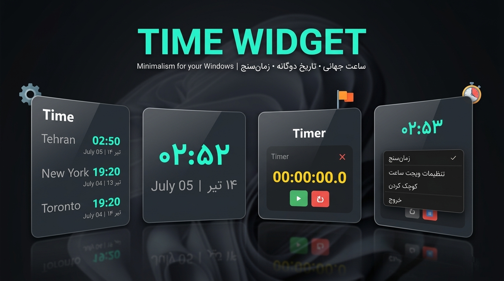

# 🕒 Window Screen Date Time Widget

<p align="center">
  
  
  
  
  
</p>

<p align="center">
  <b>یک ویجت ساعت و تاریخ دسکتاپ مینیمال، شیک و کاربردی برای ویندوز</b><br>
  <sub>توسعه‌یافته با Python و PyQt6 | پشتیبانی از تقویم شمسی و میلادی | مدیریت زمان روی دسکتاپ</sub>
</p>

<p align="center">
  
</p>

---

## ✨ ویژگی‌های کلیدی

- 🕰️ **نمایش همزمان چند ساعت** از شهرهای دلخواه با قابلیت افزودن یا حذف.
- 📅 **پشتیبانی از تقویم شمسی و میلادی** – تاریخ هجری شمسی با کتابخانه‌های استاندارد.
- 🪟 **حالت ویجت بدون حاشیه** – قابل جابه‌جایی، تغییر شفافیت و همیشه روی دسکتاپ.
- ⏱️ **زمان‌سنج و کرونومتر داخلی** – با امکان باز و بسته کردن جداگانه.
- 🚀 **اجرای خودکار با استارت ویندوز** – قابل تنظیم در بخش Settings.
- 💾 **ذخیره‌سازی ایمن تنظیمات** در مسیر استاندارد `AppData\Roaming` بدون تداخل با فایل‌های برنامه.

---

## 📥 دانلود و نصب (نسخهٔ آمادهٔ ویندوز)

برای کاربران عادی که نیاز به پایتون ندارند، فایل نصبی آماده را از بخش [**Releases**](https://github.com/mrsaeedi/Window-Screen-Date-Time-Widget/releases) دریافت کنید.

1. آخرین نسخه با پسوند `.exe` را دانلود کنید.
2. فایل را اجرا کرده و مراحل نصب را دنبال کنید.
3. برنامه از منوی Start یا با اجرای خودکار در استارتاپ در دسترس خواهد بود.

---

## 🛠️ راهنمای توسعه (برای برنامه‌نویسان)

اگر تمایل دارید ویژگی جدید اضافه کنید یا باگ‌ها را برطرف نمایید، مراحل زیر را دنبال کنید.

### ✅ پیش‌نیازها
- Python 3.9 یا بالاتر
- Git (اختیاری)

### 📥 ۱. کلون کردن مخزن

```bash
git clone https://github.com/mrsaeedi/Window-Screen-Date-Time-Widget.git
cd Window-Screen-Date-Time-Widget
🐍 ۲. ساخت محیط مجازی (venv)
bash
# ساخت محیط مجازی
python -m venv venv

# فعال‌سازی (CMD)
venv\Scripts\activate

# یا فعال‌سازی (PowerShell)
.\venv\Scripts\Activate.ps1
📦 ۳. نصب وابستگی‌ها
bash
pip install -r requirements.txt
🚀 ۴. اجرای برنامه در حالت توسعه
bash
python time_screen_widget.pyw
تمامی تغییرات به صورت زنده در پنجره قابل مشاهده خواهند بود.

📁 ساختار پروژه
text
Window-Screen-Date-Time-Widget/
├── assets/
│   ├── icon.ico                # آیکون برنامه
│   └── screenshot.png          # پیش‌نمایش برای README
├── time_screen_widget.pyw      # کد اصلی برنامه (بدون کنسول)
├── .gitignore                  # فایل‌های نادیده گرفته شده
├── requirements.txt            # کتابخانه‌های مورد نیاز
├── LICENSE                     # مجوز پروژه
└── README.md                   # همین فایل
🎨 نکات توسعه
استایل‌دهی (UI): ظاهر برنامه با setStyleSheet و فناوری QSS طراحی شده. برای تغییر رنگ یا پدینگ، بخش‌های مربوطه را در time_screen_widget.pyw ویرایش کنید.

تنظیمات برنامه: تنظیمات در فایل JSON درون مسیر AppData\Roaming\WindowScreenWidget ذخیره می‌شود و با به‌روزرسانی برنامه از دست نمی‌رود.